<div align="center">


<br/>

<a href="https://git.io/typing-svg">
  
</a>

<br/>

[](https://gautammanak.vercel.app/)
[](https://linkedin.com/in/gautammanak1)
[](https://pypi.org/user/gautammanak1/)
[](https://www.npmjs.com/package/uagent-client)
[](https://marketplace.visualstudio.com/items?itemName=gautammanak2.fetch-coder)
[](https://calendly.com/gautammanak1/call-with-gautam)

<br/>


</div>

---

## `> whoami`

```python
class GautamManak:
    role            = "Developer Advocate @ Fetch.ai · ASI1 Lead India"
    specialization  = ["AI Agent Architecture", "MCP/A2A Protocols", "DevRel & Ecosystem Growth"]
    stack           = ["Python", "TypeScript", "Next.js", "Node.js", "LangChain", "CrewAI"]
    shipped         = ["uagent-a2a-adapter (PyPI)", "asi1-mcp-cli (PyPI)",
                       "uagent-client (npm)", "Fetch Coder (VS Code)"]
    communities     = ["MeerutCodeHub — Founder", "Fetch.ai Delhi NCR — Lead", "ASI1 India — Lead"]

    impact = {
        "events_hosted":     "100+",
        "tech_talks":        "75+ (IITs, Microsoft, communities)",
        "developers_reached": "5000+",
        "cities_covered":    "Bangalore, Pune, Mumbai, Noida, Meerut",
    }
```

<br/>

<div align="center">
<table>
<tr>
<td align="center" width="50%">

### What I Do

</td>
<td align="center" width="50%">

### Impact

</td>
</tr>
<tr>
<td>

- Architect **autonomous AI agents** with uAgents, CrewAI, LangChain, MCP, A2A & Composio
- Build **production-grade full stack + Web3** apps with Next.js, React & Node.js
- Publish **open-source PyPI & npm packages** for the agent ecosystem
- Ship **VS Code extensions** powered by ASI1 API
- Create **developer education** content, workshops & documentation

</td>
<td>

- **100+** hackathons, workshops & events hosted
- **75+** tech talks at IITs, Microsoft & communities
- **5000+** developers reached & onboarded
- **Published** PyPI & npm packages used by developers globally
- **Launched** ASI1 child communities across 5+ Indian cities
- **Built** Fetch Coder extension on VS Marketplace

</td>
</tr>
</table>
</div>

---

## Experience

<table>
<tr>
<td width="80" align="center">

</td>
<td>
<strong>Developer Advocate</strong> &nbsp;•&nbsp; <a href="https://fetch.ai">Fetch.ai</a><br/>
<sub>Aug 2024 — Present &nbsp;|&nbsp; Remote</sub>
<br/><br/>
<strong>→</strong> Led <strong>100+ hackathons & workshops</strong> across India, directly onboarding thousands of developers to the uAgent ecosystem<br/>
<strong>→</strong> Shipped <strong>3 open-source packages</strong> (2 PyPI + 1 npm) and a <strong>VS Code extension</strong> used by the developer community<br/>
<strong>→</strong> Deployed production AI agents on <strong>GCP with Docker</strong>; resolved <strong>1000+ developer queries</strong> on Discord<br/>
<strong>→</strong> Owned Innovation Lab website, SDK documentation, and marketing campaigns driving measurable adoption
</td>
</tr>
<tr>
<td width="80" align="center">

</td>
<td>
<strong>Developer Advocate Intern</strong> &nbsp;•&nbsp; <a href="https://fetch.ai">Fetch.ai</a><br/>
<sub>May 2024 — Jul 2024 &nbsp;|&nbsp; Remote</sub>
<br/><br/>
<strong>→</strong> Built <strong>PoC agent projects</strong> using LangChain, OpenAI APIs, and uAgents — several shipped to production<br/>
<strong>→</strong> Led workshops across universities; improved GitHub docs and contributed to the Innovation Lab website
</td>
</tr>
<tr>
<td width="80" align="center">

</td>
<td>
<strong>Campus Ambassador</strong> &nbsp;•&nbsp; <a href="https://fetch.ai">Fetch.ai</a><br/>
<sub>Dec 2023 — May 2024 &nbsp;|&nbsp; Remote</sub>
<br/><br/>
<strong>→</strong> Organized hackathons and workshops introducing <strong>500+ students</strong> to the Fetch.ai agent ecosystem<br/>
<strong>→</strong> Mentored teams building with uAgents; led awareness campaigns increasing campus adoption
</td>
</tr>
<tr>
<td width="80" align="center">

</td>
<td>
<strong>Full Stack Engineer</strong> &nbsp;•&nbsp; KloudiDev Digital Solutions<br/>
<sub>Oct 2023 — Jun 2024 &nbsp;|&nbsp; Remote</sub>
<br/><br/>
<strong>→</strong> Built <strong>2 production products</strong> (MERN stack) with clean architecture and scalable design<br/>
<strong>→</strong> Collaborated with UX/UI designers to ship responsive interfaces using Tailwind CSS
</td>
</tr>
</table>

---

## Featured Projects

### Published Packages & Extensions

<table>
<tr>
<td width="33%">

**[uAgent-A2A-Adapter](https://pypi.org/project/uagent-a2a-adapter/)** &nbsp; [](https://pypi.org/project/uagent-a2a-adapter/)
<br/><br/>
Published Python package for integrating Agent-to-Agent systems with uAgents, enabling intelligent multi-agent coordination and communication.

</td>
<td width="33%">

**[ASI1-MCP-CLI](https://pypi.org/project/asi1-mcp-cli/)** &nbsp; [](https://pypi.org/project/asi1-mcp-cli/)
<br/><br/>
Powerful CLI for interacting with ASI:One LLM and MCP servers using natural language queries. Call and discover Agentverse agents from the Marketplace — no JSON configuration needed.

</td>
<td width="33%">

**[uagent-client](https://www.npmjs.com/package/uagent-client)** &nbsp; [](https://www.npmjs.com/package/uagent-client)
<br/><br/>
npm package to talk to any Fetch.ai uAgent from Node.js or web apps. Handles blockchain agent communication with seamless Agentverse integration.

</td>
</tr>
<tr>
<td colspan="3">

**[Fetch Coder — VS Code Extension](https://marketplace.visualstudio.com/items?itemName=gautammanak2.fetch-coder)** &nbsp; [](https://marketplace.visualstudio.com/items?itemName=gautammanak2.fetch-coder)
<br/><br/>
Sidebar AI coding assistant for VS Code & Cursor powered by ASI1. Generate code, explain bugs, create files, and ship without leaving the editor. Supports streaming replies, workspace-aware tools, web search, and file generation.

</td>
</tr>
</table>

### MCP & Agent Protocol

<table>
<tr>
<td width="50%">

**[Software Developer MCP Client Agent](https://github.com/gautammanak1/Software-Developer-MCP-Client-Agent)**
<br/><br/>
uAgents-based tool connecting to MCP servers via Server-Sent Events with a chat interface. Integrated with Flowise & Activepieces for natural language + structured command support.

</td>
<td width="50%">

**[uAgent-Google ADK Integration](https://medium.com/@gautammanak1)**
<br/><br/>
Integrated uAgents with Google ADK for decentralized AI agent ↔ conversational AI communication. Demonstrated via a real-time crypto data bot.

</td>
</tr>
</table>

### Full Stack + Web3 + AI Agents

<table>
<tr>
<td width="50%">

**[Sociantra — AI LinkedIn Automation Platform](https://mnee-ai-social.vercel.app/)**
<br/><br/>
AI-powered LinkedIn content automation platform with MNEE stablecoin (Web3) micropayments. Features AI post generation via Google Gemini, smart scheduling with cron & calendar, URL-to-Post conversion, multi-language support (7 languages), LinkedIn OAuth integration, blockchain-verified payments, team approval workflows, and analytics dashboard. Built with uAgents framework for agent-to-agent service orchestration.

</td>
<td width="50%">

**[CareerPilot — Smart Career Companion](https://github.com/gautammanak1/CareerPilot)**
<br/><br/>
Intelligent job-hunting platform with ATS-compliant resume scoring, personalized job recommendations, AI-powered mock interviews, skill gap analysis, and custom resume building with learning path guidance.

</td>
</tr>
<tr>
<td width="50%">

**[AI Thumbnail Generator](https://ai-thumbnail-generator-omega.vercel.app/)**
<br/><br/>
Full-stack app for creating AI-generated thumbnails with advanced generation capabilities. Live and production-ready.

</td>
<td width="50%">

**[Tamar Software Website](https://tamarsoftware.com/)**
<br/><br/>
Professional company website featuring responsive design, modern UI/UX, and optimized performance for business presentation.

</td>
</tr>
<tr>
<td width="50%">

**[GradPathAI](https://github.com/gautammanak1/GradPathAI)**
<br/><br/>
AI-powered platform guiding students with career advice, resume analysis, job search assistance, and mentorship.

</td>
<td width="50%">

**[MonkHood](https://github.com/gautammanak1/MonkHood)**
<br/><br/>
Productivity platform for creating, editing, and managing events, appointments & tasks with collaboration and metrics.

</td>
</tr>
</table>

### AI Agent Systems

<table>
<tr>
<td width="50%">

**[RAG Chat Agent](https://github.com/gautammanak1/RAG-Chat-Agent)**
<br/><br/>
Retrieval-Augmented Generation agent combining Agno RAG with uAgent's distributed protocol. Hybrid semantic + keyword search with real-time PDF processing.

</td>
<td width="50%">

**[Discussion Team Agent](https://github.com/gautammanak1/Discussion-Team-Agent)**
<br/><br/>
Multi-agent system gathering insights from HackerNews discussions, academic papers, and Twitter trends for holistic topic analysis.

</td>
</tr>
<tr>
<td width="50%">

**[Gmail-ASI-Agent](https://github.com/gautammanak1/Gmail-ASI-Agent)**
<br/><br/>
Intelligent Gmail assistant deployed on AgentVerse with dynamic auth — reads emails, manages contacts, handles spam via natural language.

</td>
<td width="50%">

**[Blood Report Analysis Agent](https://github.com/gautammanak1/Blood-Report-Analysis-Agent)**
<br/><br/>
Analyzes blood test PDFs from Google Drive and delivers comprehensive health summaries with tailored recommendations.

</td>
</tr>
<tr>
<td width="50%">

**[Shopping Partner Agent](https://github.com/gautammanak1/Shopping-Partner-Agent)**
<br/><br/>
AI-powered product recommender that searches trusted e-commerce sites and verifies availability based on user preferences.

</td>
<td width="50%">

**[AI-Agents Collection](https://github.com/gautammanak1/AI-Agents)**
<br/><br/>
Suite of AI agents for job search, hackathon discovery, profile recommendations, vehicle challan retrieval, and more.

</td>
</tr>
</table>

---

## Tech Stack

<div align="center">

### Languages


### AI & Agent Technologies


### Frontend


### Backend & APIs


### Databases


### DevOps, Cloud & Tools


</div>

---

## Recent Activity

<!--START_SECTION:activity-->
1. 🎉 Merged PR [#2](https://github.com/gautammanak1/asi1-vs-code/pull/2) in [gautammanak1/asi1-vs-code](https://github.com/gautammanak1/asi1-vs-code)
2. 💪 Opened PR [#2](https://github.com/gautammanak1/asi1-vs-code/pull/2) in [gautammanak1/asi1-vs-code](https://github.com/gautammanak1/asi1-vs-code)
3. 🎉 Merged PR [#1](https://github.com/gautammanak1/asi1-vs-code/pull/1) in [gautammanak1/asi1-vs-code](https://github.com/gautammanak1/asi1-vs-code)
4. 💪 Opened PR [#1](https://github.com/gautammanak1/asi1-vs-code/pull/1) in [gautammanak1/asi1-vs-code](https://github.com/gautammanak1/asi1-vs-code)
5. 🗣 Commented on [#202](https://github.com/google-agentic-commerce/AP2/pull/202#issuecomment-4150181448) in [google-agentic-commerce/AP2](https://github.com/google-agentic-commerce/AP2)
<!--END_SECTION:activity-->

---

## Dev Metrics

<!--START_SECTION:waka-->


**🐱 My GitHub Data** 

> 📦 1.3 MB Used in GitHub's Storage 
 > 
> 🏆 236 Contributions in the Year 2026
 > 
> 💼 Opted to Hire
 > 
> 📜 117 Public Repositories 
 > 
> 🔑 47 Private Repositories 
 > 
**I'm an Early 🐤** 

```text
🌞 Morning                0 commits           ░░░░░░░░░░░░░░░░░░░░░░░░░   00.00 % 
🌆 Daytime                0 commits           ░░░░░░░░░░░░░░░░░░░░░░░░░   00.00 % 
🌃 Evening                0 commits           ░░░░░░░░░░░░░░░░░░░░░░░░░   00.00 % 
🌙 Night                  0 commits           ░░░░░░░░░░░░░░░░░░░░░░░░░   00.00 % 
```


📊 **This Week I Spent My Time On** 

```text
🕑︎ Time Zone: Asia/Kolkata

💬 Programming Languages: 
No Activity Tracked This Week

🐱‍💻 Projects: 
No Activity Tracked This Week
```


 Last Updated on 03/04/2026 22:42:07 UTC
<!--END_SECTION:waka-->

---

## Coding Stats (All Time)

<!--START_SECTION:wakasimple-->

```txt
From: 03 April 2026 - To: 03 April 2026

No activity tracked
```

<!--END_SECTION:wakasimple-->

---

## Latest Blog Posts

<!-- BLOG-POST-LIST:START -->
- [Kombai vs Figma MCP: The Ultimate Developer’s Guide](https://medium.com/@gautammanak1/kombai-vs-figma-mcp-the-ultimate-developers-guide-9dd2a739f5aa?source=rss-80f092f26777------2) Oct 10, 2025
- [&quot;Rust and TypeScript&quot;](https://dev.to/gautammanak1/rust-and-typescript-4h3d) Aug 30, 2025
- [JavaScript &amp; TypeScript: A Developer&#39;s Deep Dive](https://dev.to/gautammanak1/javascript-typescript-a-developers-deep-dive-mjo) Jul 21, 2025
- [JavaScript and TypeScript](https://dev.to/gautammanak1/javascript-and-typescript-549l) Jul 21, 2025<!-- BLOG-POST-LIST:END -->

> Powered by [blog-post-workflow](https://github.com/gautamkrishnar/blog-post-workflow) — auto-fetches from [Dev.to](https://dev.to/gautammanak1) & [Medium](https://medium.com/@gautammanak1)

---

## GitHub Analytics

<div align="center">


</div>

---

## Contribution Graph

<div align="center">


</div>

---

## Achievements

<div align="center">


</div>

---

## Notable Contributions & Repos

<div align="center">


</div>

---

## Starred Topics

<div align="center">


</div>

---

## Commit Calendar

<div align="center">


</div>

---

## Coding Habits

<div align="center">



</div>

---

## Leadership & Community

<div align="center">
<table>
<tr>
<td align="center" width="33%">

**MeerutCodeHub** — Founder & Lead
<br/><sub>Dec 2022 — Present</sub>
<br/><br/>
Organized 20+ tech events, hackathons & coding competitions attracting 500+ attendees each. Built a vibrant developer community in Meerut, India.

</td>
<td align="center" width="33%">

**Fetch.ai Developer Community** — Lead
<br/><sub>Dec 2023 — Present &nbsp;|&nbsp; Delhi NCR</sub>
<br/><br/>
Hosted 100+ Fetch.ai uAgent events across India including a hackathon at Microsoft Office Gurugram with 200+ participants.

</td>
<td align="center" width="33%">

**ASI1 Lead India** — Community Lead
<br/><sub>2024 — Present &nbsp;|&nbsp; Pan-India</sub>
<br/><br/>
Launched the ASI1 child community across India with offline-first presence in Bangalore, Pune, Mumbai, Noida & Meerut. Hired campus ambassadors & city leads to drive ASI1.ai engagement, organized local meetups, and onboarded developers to the ASI1 ecosystem.

</td>
</tr>
</table>
</div>

### Achievements

- Delivered **75+ talks** at colleges (including IITs) and Microsoft offices across India
- **Top 10 Runner-Up** — CodeNight Hackathon by Squareboat (Feb 2023)
- Published **3 open-source packages** (2 PyPI + 1 npm) used by the developer community
- Shipped **Fetch Coder** — AI coding extension on the VS Code Marketplace

---

<div align="center">

## Let's Connect

<br/>

I'm selectively open to **AI/Agent engineering roles**, **DevRel positions**, **contract development**, and **ecosystem partnerships**.

If you're building in the agent space — let's talk.

<br/>

[](https://gautammanak.vercel.app/)
[](mailto:gautammanak1@gmail.com)
[](https://calendly.com/gautammanak1/call-with-gautam)
[](https://drive.google.com/file/d/1v-mogFsBPvZ_zemrcNNPKMfrca5UUi3o/view?usp=sharing)

<br/>

[](https://buymeacoffee.com/gautammanak1)

<br/>

<sub>Available for contract-based development &nbsp;•&nbsp; Open to relocation for the right opportunity</sub>

<br/><br/>


</div>
